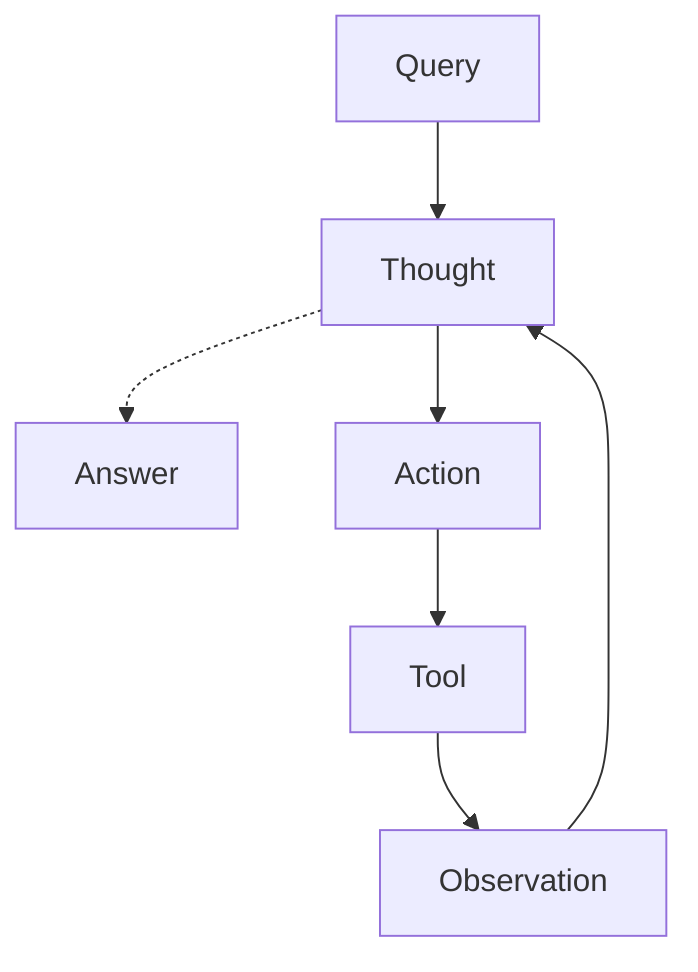

## Agents under the hood

This lesson removes the create_agent abstraction and rebuilds the agent loop by hand, at three levels of depth.

### The three layers

Layer 0, covered in the search agent branch, is the fully abstracted version.

Layer 1 removes that abstraction and writes the loop by hand, in two steps.
First with LangChain helpers such as bind_tools, ToolMessage, and init_chat_model.
Second with raw JSON schemas and a direct call to ollama.chat, with no LangChain wrapper at all.

Layer 2 goes one step further and removes function calling entirely, replacing it with a raw ReAct prompt that the model fills in as plain text, parsed with regex.

### The ReAct pattern

The model receives a query, thinks about what to do, chooses an action such as calling a tool, gets back an observation from that tool, and loops back to thinking again. This repeats until the model decides it has enough information to give a final answer instead of taking another action.

### Layer 0, script: 1_agent_loop_langchain_tool_calling.py

This  writes the agent loop manually using LangChain building blocks, instead of letting create_agent hide the loop from you.

Key functions and what each one does.

`init_chat_model`connects to whichever model you choose, in this case a local Ollama model, llama3.2 3b, by passing the string ollama colon llama3.2 3b.

The `@tool` decorator turns a normal Python function into something the model can call, using its docstring as the description the model reads to decide when to use it.

`  bind_tools`  attaches the list of tools to the model so every request sent to the model includes information about what tools are available and what arguments each one expects.

`  llm_with_tools.invoke`   sends the current conversation to the model and gets back either a plain answer or a request to call one or more tools, never both actually executed by the model itself. The model only asks, your code does the actual calling.

`toolMessage`carries the result of a tool call back into the conversation, tagged with the same id as the original tool call so the model can match the result to the request it made.

### Trace of a real run

Question asked: What is the price of a laptop after applying a gold discount

 **Iteration 1.** Model called get_product_price with product laptop. Result: 130.0.

**Iteration2.**pply_discount with price 130 and discount_tier gold. Result: 100.1, calculated as 130 times 0.77 for the 23 percent gold discount.

**Iteration3.**ore tool calls and returned the final answer, stating the price after the gold discount is 100.10.

Note on error handling. In an earlier run, the model attempted apply_discount before calling get_product_price, skipping the required price argument. That failure was caught and fed back to the model as a ToolMessage, and the model corrected itself on the next attempt. This is the reason the loop wraps every tool call in a try block instead of letting a bad call crash the whole script.

### What appears in LangSmith

Each call to run_agent appears as one trace, named langchain_loop, matching the name given to the traceable decorator.

Inside the trace, every call to llm_with_tools.invoke shows up as its own step, including the exact messages sent to the model and the exact response, including any tool calls it requested.

Every tool execution also shows up as its own step, with its inputs and outputs, so you can see exactly which tool ran, with what arguments, and what it returned, without needing extra print statements in your code.

This is useful for debugging, since when a tool call fails, like the missing price argument mentioned above, you can see the full message history that led to it directly in the trace, instead of only in your terminal output.