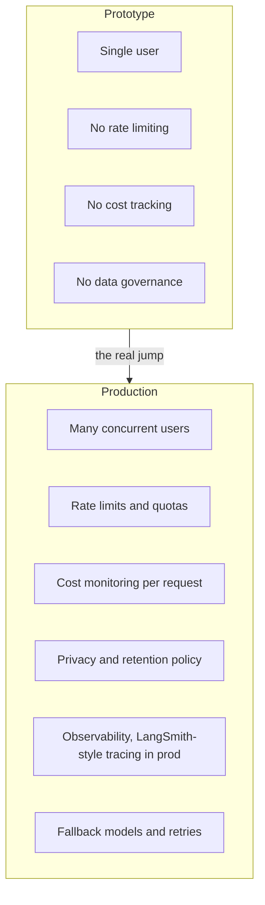
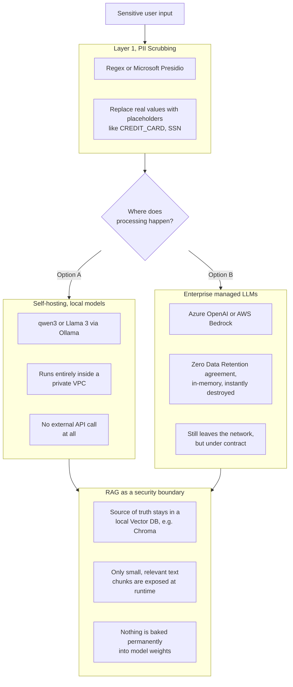
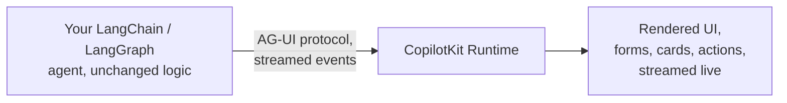
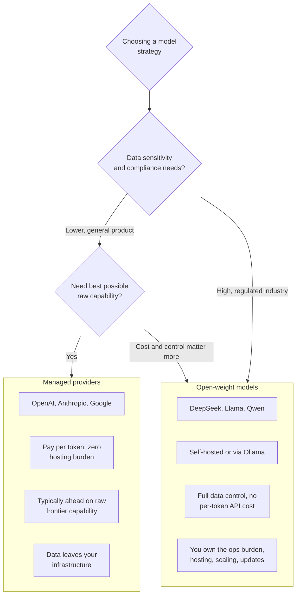

# LLM Production Landscape and Course Wrap-up

Notes from the final theoretical chapter of the course, covering the real-world landscape around building and shipping LLM applications, privacy and compliance, generative UI, the open source versus managed debate, trust in AI output, and where to go after finishing the course.

---

##LLM Applications in Production and the Development Landscape

These two lectures set the stage, moving from "does my code work" to "is this safe to actually ship."

**The gap between a working prototype and a production LLM application.** Everything built so far in this course runs on a laptop, with no concurrent users, no cost controls, and no compliance obligations. Production introduces concerns that never show up in a single-script demo.

**The development landscape today** is genuinely fragmented across several layers, and it's worth being able to name them clearly in an interview. Model providers, OpenAI, Anthropic, Google, and increasingly open-weight options. Orchestration frameworks, LangChain and LangGraph being what this course is built on, with CrewAI, LlamaIndex, and others occupying similar space. Vector databases, Pinecone, Chroma, Qdrant, Weaviate, and more, already covered in the rag-gist branch. Observability tooling, LangSmith being the one used throughout this course. And increasingly, UI layers built specifically for agents rather than generic chat widgets, which is exactly what lecture 79 covers.

**Why this matters for an interview.** Being able to say "here's the stack I built with, and here's where it sits relative to the alternatives" demonstrates you understand the landscape, not just one tutorial's specific tool choices.

---

## 78, Privacy and Data Retention in Production

This is the most consequential lecture of the chapter for anyone deploying to a regulated industry, finance, healthcare, legal.

### The core compliance problems

**Privacy, training data leakage.** Consumer-facing web interfaces, the default ChatGPT experience being the clearest example, have historically trained on user inputs unless a user opts out. Standard API tiers from the same companies typically do not train on API traffic by default. But even when training isn't the issue, the API payload itself still physically leaves your company's network and touches a third party's infrastructure, which is an exposure in itself, independent of whether that data is later used for training.

**Data retention, log storage.** Confirmed directly from current provider documentation: OpenAI's API retains prompts and responses for 30 days by default, specifically for abuse monitoring, Azure OpenAI and AWS Bedrock follow a similar default pattern. For a regulated sector like healthcare or finance, having a customer's sensitive data written to a third party's server log for even that single day, let alone thirty, can itself be a compliance violation, regardless of whether anyone ever actually reads that log.

### Architectural solutions, defense in depth

No single technique here is sufficient alone, real production systems layer several of these together.

**Enterprise managed LLMs.** Azure OpenAI and AWS Bedrock both offer Zero Data Retention as a contractual option, but it is genuinely an opt-in, not a default. Standard pay-as-you-go API tiers from any provider still fall under the default 30-day retention, ZDR specifically requires an enterprise agreement, and for Azure specifically, a dedicated resource rather than a shared endpoint. Under a real ZDR agreement, the payload is processed in memory and destroyed immediately after the response, nothing is written to a persistent log at all.

**Self-hosting, local models.** This is the path you've been using throughout this entire course, Ollama running `qwen3` or Llama models locally. Deployed inside a company's own private VPC rather than on a laptop, this architecture eliminates the external API call entirely, there is no third party server to retain anything, because no data ever left the organization's own infrastructure in the first place. This is the strongest guarantee of the group, at the cost of needing to self-manage model quality, hosting, and scaling.

**PII scrubbing middleware.** A sanitization layer sitting between the user and any external API call, using regex patterns or a dedicated tool like Microsoft Presidio, detects and masks personally identifiable information, a credit card number becomes `[CREDIT_CARD]`, a social security number becomes `[SSN]`, before the text is ever sent out. The placeholders are swapped back in locally once the response returns, so the external provider never actually sees the real sensitive values at all.

**RAG as a security feature, not just a quality feature.** This is a genuinely important reframing worth remembering, RAG isn't only about keeping answers current, it is itself a privacy architecture. The alternative to RAG, fine-tuning a model directly on a company's sensitive internal documents, risks permanently baking those secrets into the model's weights, where they could in principle be extracted or leaked through the model itself later. RAG instead keeps the actual source of truth locked inside a secure, local vector database, and only ever exposes small, specific, ephemeral chunks of text to the LLM at the moment of answering a particular question, nothing is permanently absorbed into the model.

### Why your own course architecture already satisfies this

Every branch you've built, Chroma as a local vector store, HuggingFace embeddings running entirely on your machine, Ollama for local model inference, already matches the strongest tier of this privacy architecture by construction, not by accident. When writing a README for any of your production-oriented branches, this is worth stating explicitly, your RAG pipeline keeps the source of truth in a local vector database and only sends small retrieved chunks to the LLM, and your local Ollama option processes everything inside your own machine with zero external API calls at all. This is a genuine, defensible architectural strength to be able to articulate in an interview, not just a workaround for a Pinecone connectivity issue.

---

## 79, Generative UI and UX, featuring CopilotKit

**The problem this space addresses.** A standard chat interface, the kind built in the documentation-helper branch, only returns text. But an agent's output is often structured, a form to fill out, a set of selectable options, a chart, a confirmation dialog, and cramming all of that into plain chat text is a poor user experience.

**Generative UI** is the pattern where an agent doesn't just generate text, it generates or updates actual UI components at runtime, dynamically, based on what it's currently doing and what the user needs next.

**CopilotKit**, confirmed from its current documentation, is the company and open source SDK behind this space, and the creator of a protocol called **AG-UI**, the Agent-User Interaction protocol. AG-UI defines a standard wire format for streaming an agent's actions, tool calls, and state changes to a frontend in real time, so the UI layer can render exactly what's happening as it happens, rather than waiting for a single final text blob. It's explicitly designed to plug into existing agent frameworks, including LangChain and LangGraph directly, your agent logic itself doesn't need to change, AG-UI handles the protocol between your backend agent and whatever frontend renders it.

**Why this is relevant to your documentation-helper project specifically.** Right now, `main.py` renders answers and sources as plain markdown text inside Streamlit. A generative UI layer would instead let the agent render, for example, each retrieved source as an interactive card the user could click to expand, or a structured citation component, rather than a flat bulleted list. Not something to necessarily rebuild right now, but worth knowing this is the direction more sophisticated agent UIs are heading, and worth naming in an interview if asked how you'd evolve a chat-only interface.

---

## 80, Official LangChain Academy Courses

LangChain maintains its own official, free learning courses, separate from this third party Udemy course, covering LangChain and LangGraph fundamentals directly from the source, at `academy.langchain.com`. Worth knowing these exist as a next step after this course, specifically because official documentation and courses track the current API more closely than any third party course can, given how quickly this ecosystem has changed even over the course of this project, multiple model deprecations and API shape changes already hit directly during this course's own branches.

---

## 81, Open Source LLMs versus Managed LLM Providers, DeepSeek

A direct extension of the privacy and architecture discussion from lecture 78, framed here as a broader strategic decision rather than just a compliance one.

**DeepSeek's significance in this debate**, open-weight models like DeepSeek demonstrated that open source models could approach the quality of closed, managed frontier models at a fraction of the typical training and inference cost, which meaningfully shifted this conversation. Before that, "open source" often implicitly meant "noticeably weaker but cheaper." The gap narrowing changes the calculus, for many real applications, a capable open-weight model, self-hosted, becomes a genuinely competitive choice rather than purely a budget compromise.

**The tradeoff that doesn't go away regardless of model quality.** Managed providers remove essentially all operational burden, you call an API, you pay per token, scaling and uptime are someone else's problem. Self-hosting, whether DeepSeek, Llama, or the `qwen3` and `llama3.2` models you've used via Ollama throughout this course, shifts that operational burden onto you or your team, but buys full data control and no per-token cost, which is exactly why it was the right choice for the privacy architecture discussed in lecture 78.

---

## 82, Confidence in AI Results, by Assaf Elovic and Harrison Chase

This lecture addresses a problem that sits underneath everything built in this course so far, every single response from every model you've called has been treated as correct by default, with no mechanism checking whether it actually was.

**The core issue.** LLMs generate text that is fluent and confident-sounding regardless of whether it's factually correct, there is no built-in signal distinguishing a well-grounded answer from a hallucinated one, the token probabilities behind generation don't map cleanly onto real-world truthfulness.

**Why this matters concretely, tied to your own RAG work.** RAG reduces hallucination risk by grounding answers in retrieved real text, but it doesn't eliminate it. The model can still misread or misquote a retrieved chunk, or blend two different chunks incorrectly, your `format_docs` function labeling each chunk with its source helps a human verify this after the fact, but nothing in the pipeline itself currently checks whether the generated answer is actually faithful to what was retrieved.

**Approaches to building confidence into a system**, a few concrete directions worth naming:
- **Citation-grounding**, forcing the model to cite specific sources for each claim, which is exactly what your `retrieve_context` tool's `content_and_artifact` pattern enables, a user can trace an answer back to its actual source rather than trusting it blindly.
- **Self-consistency checks**, generating an answer multiple times, or asking a second model call to evaluate the first one's output against the retrieved context, and flagging disagreement.
- **Structured output with explicit uncertainty fields**, extending a Pydantic schema like the `AgentResponse` built in the search-agent branch to include a confidence field the model must fill in, rather than only an answer.
- **Human-in-the-loop for high-stakes decisions**, not automating the final call at all for anything consequential, surfacing the retrieved evidence to a human instead.

**Why this is worth being able to discuss in an interview.** It demonstrates you understand that shipping an LLM application responsibly means thinking past "does it produce an answer" to "how do I know when to trust the answer it produced," which is precisely the gap between a course project and a genuinely production-ready system.

---

## 83, AI FOMO is the New Normal

**The core observation.** The pace of change in this specific field has been fast enough to be disorienting even within the span of a single course, directly confirmed by your own experience, `gemini-2.0-flash` was deprecated mid-course, LangChain's `init_chat_model` provider defaults shifted in ways that caused real bugs, and model recommendations from earlier in the course, `llama3.2:3b`, were later found less reliable than `qwen3` for tool calling, discovered through direct testing, not foreknowledge.

**The practical response to this, rather than anxiety about constantly falling behind.** Depth in fundamentals outlasts any specific tool. Everything genuinely durable in this course, the RAG pipeline (load, split, embed, store, retrieve, augment, generate), the agent loop (reason, act, observe, repeat), and why context engineering matters, remains true regardless of which specific model or library implements it next year. The actual skill worth building is the ability to read an error message, check current documentation, and adapt quickly, exactly the debugging workflow practiced across every branch in this course, rather than trying to memorize a fixed stack that will inevitably shift.

---

## 84, Finished the Course, What's Next

Topics the course's own module list points toward beyond what's been built so far, useful for orienting future study, not yet covered in depth in this repo.

- **LangGraph proper**, state graphs, checkpoints, persistence across sessions, and human-in-the-loop interrupts, going beyond the simple loops built by hand in the agents-under-the-hood branch.
- **Multi-agent architectures and reflection or reflexion patterns**, agents that critique and improve their own output, or coordinate with sub-agents, directly connected to the sub-agent architecture discussed in the context engineering notes.
- **Formal evaluation frameworks**, moving from manual, eyeballed testing to systematic benchmarking of agent and RAG quality, a natural next step given the confidence and trust discussion in lecture 82.
- **MCP, the Model Context Protocol**, a standardized way for agents to discover and call external tools and data sources, named in the course's own title but not yet built hands-on in this repo.
- **Agentic RAG**, retrieval that itself becomes multi-step and self-correcting, rather than a single retrieve-then-generate pass.

---

## Summary, tying the whole chapter together

This chapter moves outward from the code itself to the context a real LLM application has to survive in, who can see the data, what happens when a provider changes a model overnight, how a team decides between hosting their own weights or renting someone else's, and how anyone actually knows whether to trust what the model said. None of this changes how to write a LangChain chain, but all of it changes whether a chain built in this course is ready to become something a real company could actually ship.