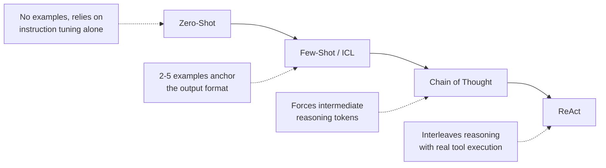
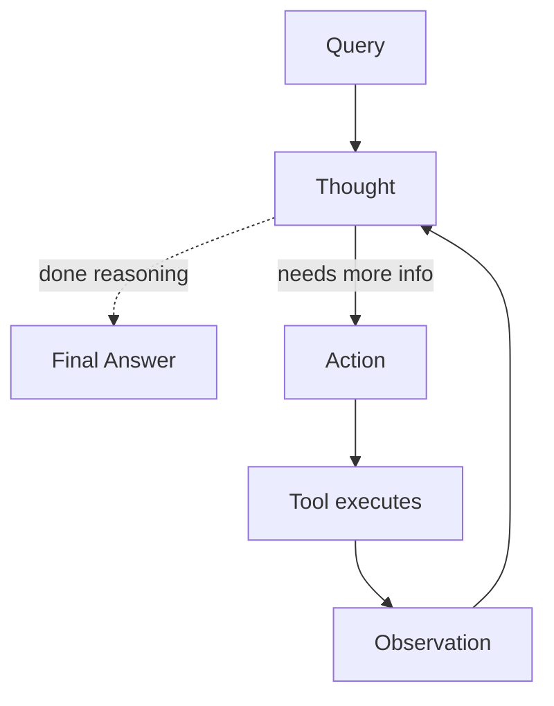
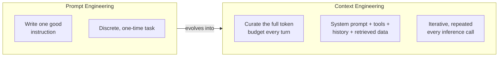
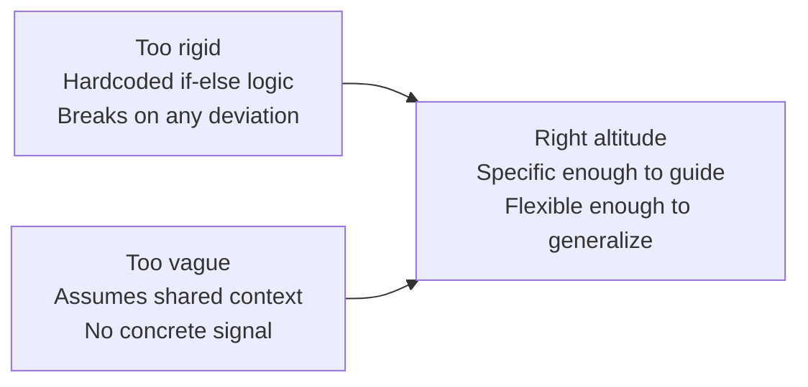
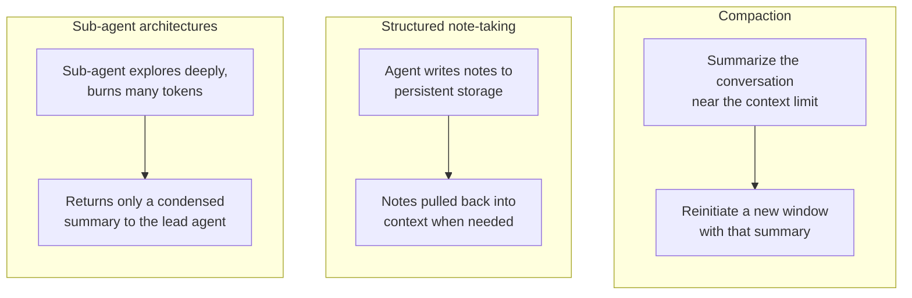

# Prompt Theory and Context Engineering

Notes from the theoretical session on prompting strategies, the ReAct architecture, and Anthropic's framing of context engineering as the evolution of prompt engineering.

Source for the second half: Anthropic, "Effective context engineering for AI agents,", https://www.anthropic.com/engineering/effective-context-engineering-for-ai-agents

---

## Part 1, Prompt Theory, the established baseline

### The progression, from least to most structure

Each step adds structure the model can lean on, and each one exists specifically to fix a failure mode of the step before it.

### Zero-shot prompting

Relies entirely on the model's instruction tuning and its attention mechanism's learned biases to produce the right kind of output, with no examples at all. Fast to write, but fragile exactly where strict syntax or a specific sequence of steps is required, there's nothing anchoring the model to your exact expected shape, so it falls back on whatever shape it saw most often during training.

### Few-shot prompting, in-context learning

Injects a small number of examples, typically two to five, directly into the prompt. This isn't just "showing an example," it concretely narrows the probability distribution over what the model generates next, anchoring it toward the exact format demonstrated and away from plausible-but-wrong alternatives.

**This is not abstract for you.** You saw this directly in the raw ReAct branch, the model initially wrote `Action: get_product_price(product="laptop")`, function-call style, ignoring the two-line format the instructions asked for. Paragraphs of additional instructions didn't fix it. One single worked example, showing exactly `Action:` and `Action Input:` on separate lines, fixed it immediately. That's few-shot prompting solving a real, specific failure, not a textbook abstraction.

### Chain of Thought, CoT

Forces the model to generate intermediate reasoning tokens, a `Thought` step, before producing a final answer. The mechanical reason this helps, each generated token becomes part of the input for generating the next one, so a written-out reasoning chain gives the model a kind of scratchpad to build the answer up step by step, rather than needing to leap directly from question to correct answer in one shot, which is a much higher-variance, more failure-prone jump for anything requiring multiple logical steps.

### ReAct, Reasoning and Acting

Interleaves reasoning with actual execution, `Thought` leads to `Action`, `Action` leads to an `Observation`, and that observation feeds back into the next `Thought`.

**The interview trap, and the thing most worth being able to say clearly.** The LLM executes absolutely nothing. It only ever generates text, an `Action` line is not a function call, it is a request written in words. Your backend code is what reads that text and decides what to actually do. Two very concrete consequences of this, both things you hit directly in your own agents-under-the-hood branch:

1. **Parsing order is part of correctness, not just code style.** You personally found a real bug of this exact shape, your parsing code checked for `Final Answer` text before checking for a genuine pending `Action`, so when the model wrote both an `Action` line and a `Final Answer` line in the same generation, before the tool had actually run, your code trusted the hallucinated final answer and returned the wrong, pre-discount price. No crash, no error, a confidently wrong result. The fix was always checking for a real `Action` first.

2. **`stop=["\nObservation"]` is a hard brake, not a convenience setting.** Since the model only generates text, nothing stops it from writing its own guess at what the `Observation` should contain, inventing a plausible-looking tool result instead of waiting for the real one. The `stop` sequence forces generation to halt the instant the model writes the word `Observation`, so your code can inject the real tool output in its place rather than letting the model hallucinate it. Remove this, and the whole ReAct loop's reliability collapses, since the model's fabricated observations look exactly as confident as real ones.

---

## Part 2, Context Engineering, the paradigm shift

Anthropic frames this as the natural evolution of prompt engineering, not a replacement for it. Prompt engineering is about writing a single good instruction. Context engineering is about curating the *entire* set of tokens the model sees at every single inference step, system prompt, tools, message history, retrieved documents, everything, and doing that curation repeatedly, every turn, not once.

### Why this matters, the actual mechanism, not just a best practice

This is the part worth understanding at a hardware level, not just accepting as advice. Transformers let every token attend to every other token across the whole context, which means for `n` tokens, there are `n²` pairwise relationships to compute attention over. As context grows, the model's attention gets spread thinner across all of those relationships. Combined with the fact that models see far more short sequences than long ones during training, they simply have less specialized capacity for very long-range dependencies. The documented result is **context rot**, accuracy at recalling or using information degrades as the context window fills, even though the information is technically still "in there." This isn't a sudden cliff, it's a gradual tax on every additional token, which is exactly why Anthropic frames context as a finite, precious resource rather than something to maximize.

### The four pillars, and where you've already been doing them

**1. Information density.** Maximize signal-to-noise, don't dump whole documents into the prompt. Retrieve only the precise relevant slice.

Your `RecursiveCharacterTextSplitter(chunk_size=4000, chunk_overlap=200)` in `ingestion.py` is a direct, working implementation of this principle, splitting a whole crawled page down to just the chunks that are actually semantically relevant to a given query, rather than handing the model an entire documentation page and hoping it finds the right paragraph.

**2. Context serialization and formatting.** Create strict, explicit boundaries in the text you hand the model, so it can tell where one piece of information ends and the next begins.

Your `format_docs` function, joining retrieved chunks with `"Source: {url}\n\nContent: {text}"` and blank-line separators, is exactly this. The explicit `Source:` and `Content:` labels aren't decoration, they're what lets the model correctly attribute a fact to the right source instead of blending two different documents' content together. The `content_and_artifact` pattern in `retrieve_context` is the same idea applied one level further, the model only receives the clean, serialized text it needs to reason with, while the full `Document` objects, with their metadata, are kept separately as the artifact for your application code to use for citations, nothing the model doesn't need gets added to its context.

**3. Prompt scaffolding, the "right altitude."** Anthropic describes a spectrum with two failure modes on either end, hardcoded, brittle, overly specific logic at one extreme, which breaks the moment reality deviates slightly from what you anticipated, and vague, underspecified guidance at the other extreme, which gives the model nothing concrete to anchor to.

Structured templates like `ChatPromptTemplate`, cleanly separating system instructions, chat history, and user input into distinct labeled sections, are how you keep the model's attention correctly weighted toward each part of the context, rather than one undifferentiated block of text where the model has to guess what's an instruction versus what's user data.

**4. Long-horizon state management.** For tasks that run far longer than a single context window can comfortably hold, Anthropic names three specific techniques.

**Compaction** summarizes a conversation nearing its context limit and restarts with that summary instead of the full history, deliberately keeping architectural decisions and unresolved issues while discarding raw tool outputs that are no longer needed verbatim.

**Structured note-taking**, what Anthropic calls agentic memory, has the agent write notes to storage outside the context window, a `NOTES.md` file is their own concrete example, which get read back in later. This is conceptually the same pattern as your raw ReAct **scratchpad**, a growing string tracking state across iterations, just persisted outside a single run rather than only within one.

**Sub-agent architectures** let a specialized sub-agent explore extensively using tens of thousands of tokens, then hand back only a condensed, 1,000 to 2,000 token summary, keeping the detailed exploration isolated from the main agent's own context.

### Why "just in time" retrieval is a related, newer idea

Rather than pre-loading all potentially relevant data up front, agents can instead keep lightweight references, file paths, stored queries, and fetch the actual data into context only at the moment it's needed, mirroring how people use a filing system or bookmarks rather than memorizing everything. This trades some speed for a much leaner context, and Anthropic notes real agents often use a hybrid, loading some things up front for speed and exploring the rest on demand.

---

## Key takeaway, tying both halves together

Prompt theory is about how to phrase and structure a single instruction well. Context engineering is the broader discipline of deciding, at every single turn, exactly which tokens out of everything available, instructions, tools, history, retrieved documents, deserve to occupy the model's limited attention budget right now. Every technique in your course so far that looked like "good practice," tight chunking, clearly labeled sources, keeping prompts specific but not brittle, is a specific instance of this one underlying principle, find the smallest set of high-signal tokens that gets the outcome you need.